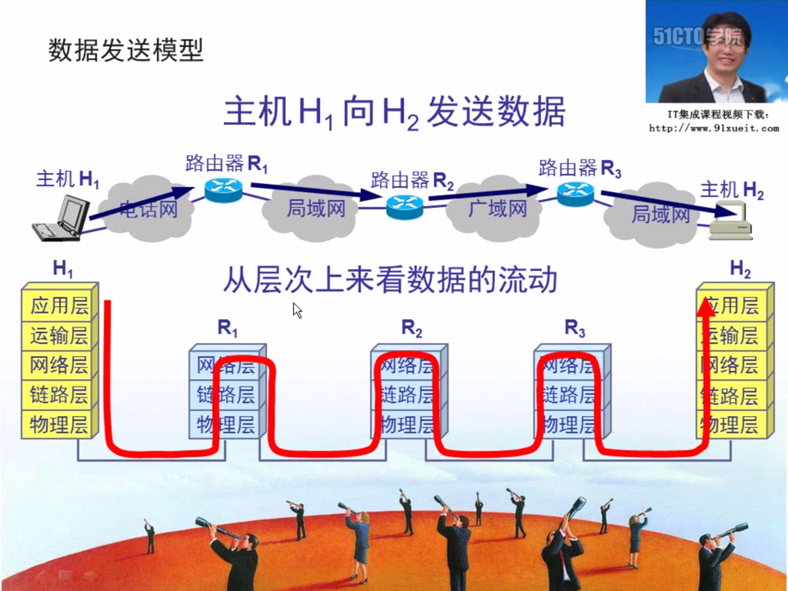
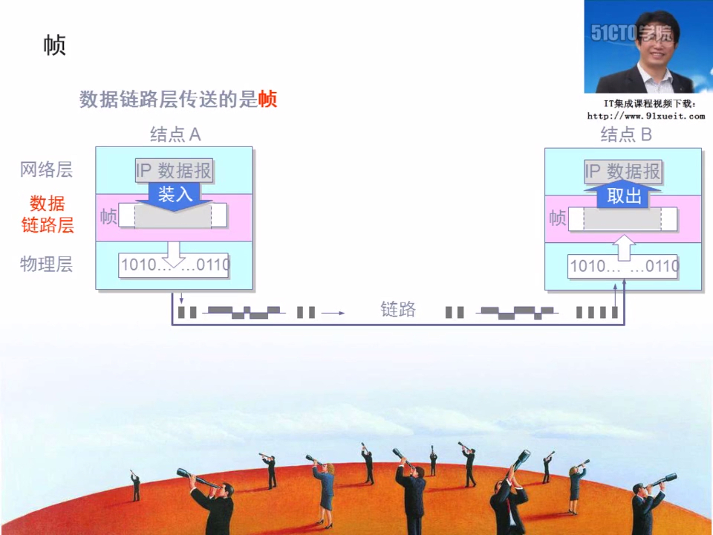
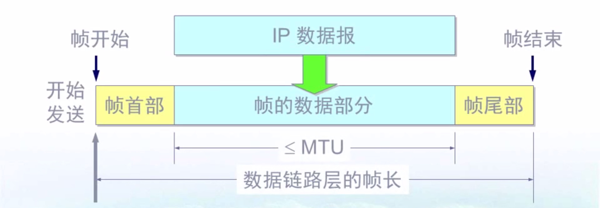
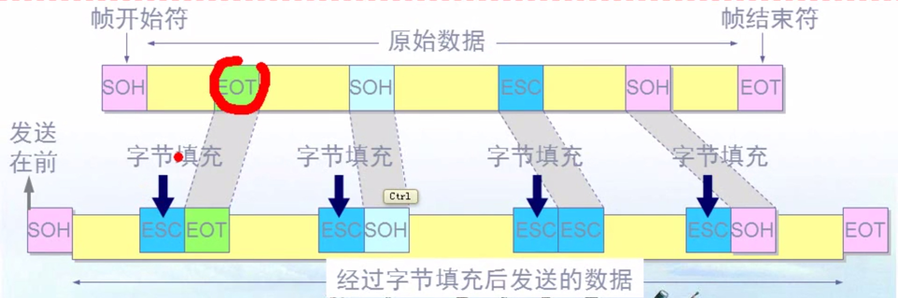
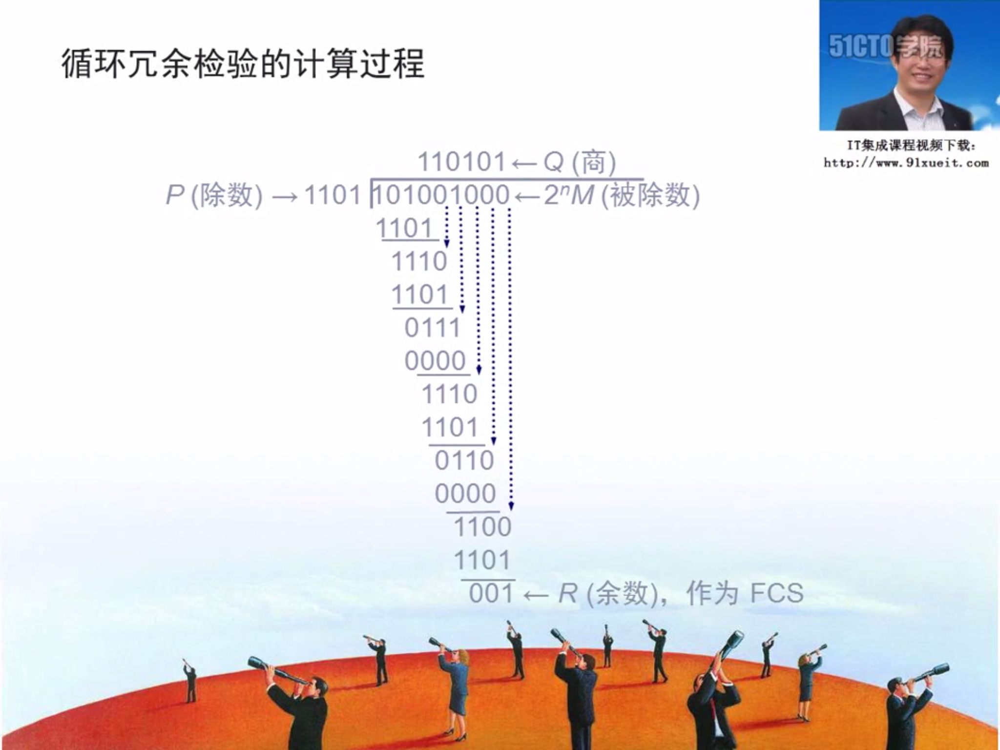
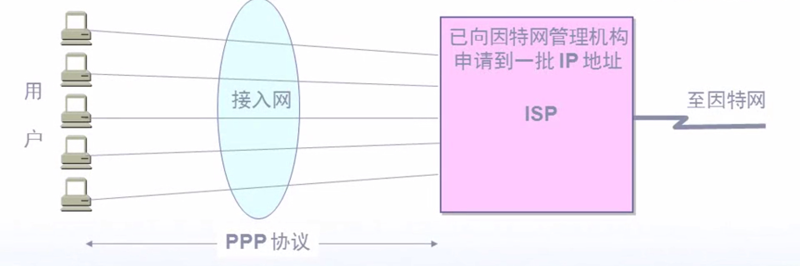
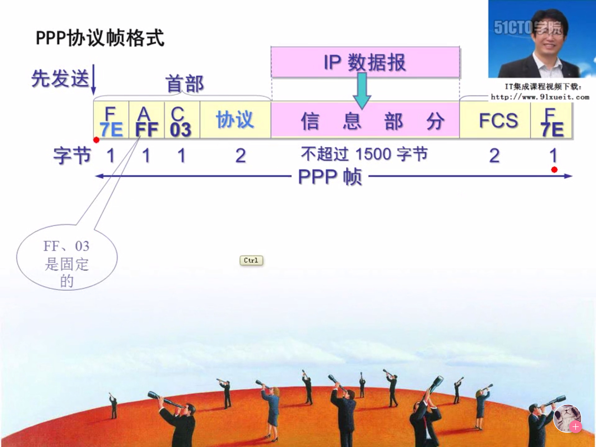
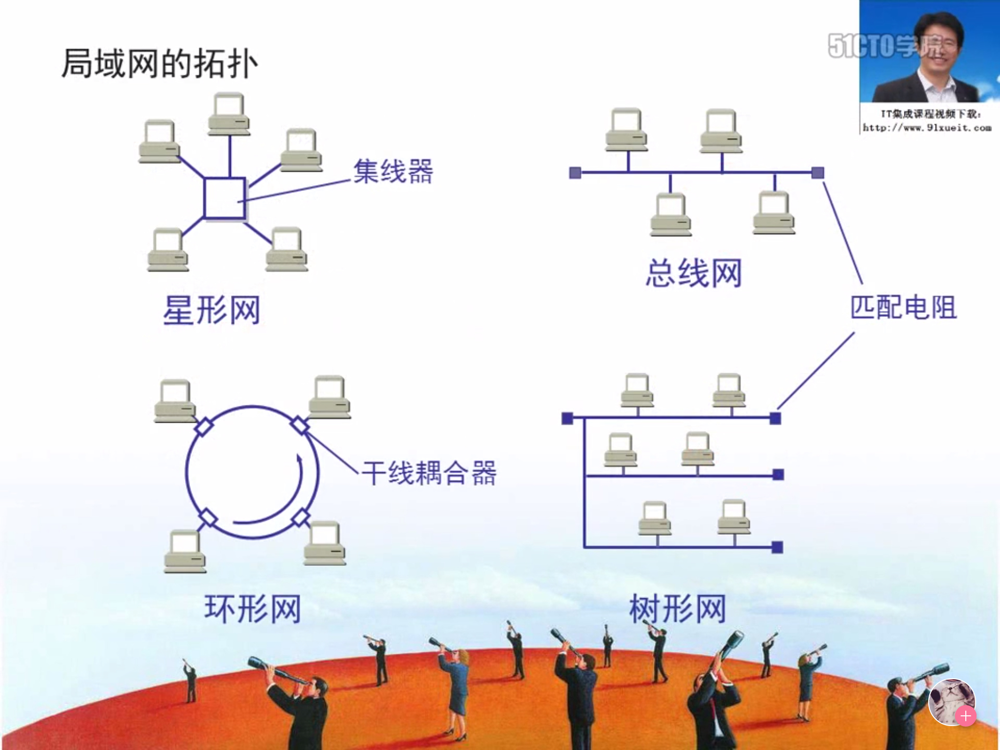

<!--
 * @Description: 
 * @version: 
 * @Author: Yuanshuo_Mac
 * @Date: 2020-03-10 15:30:45
 * @LastEditors: Yuanshuo_Mac
 * @LastEditTime: 2020-03-14 21:55:20
 -->
## 数据链路层基本概念及基本问题
### 基本概念

- 数据链路层使用的信道主要有以下两种类型
    - 点对点信道：这种信道使用一对一的点对点通信方式
    - 广播信道：这种信道使用一对多的广播通信方式，因此过程比较复杂。广播信道上连接的主机很多，因此必须使用专用的共享信道协议来协调这些主机的数据发送。
- 链路与数据链路
    - 链路(link)是一条点到点的物理线路段，中间没有任何其他接入点，一条链路只是一条通路的一个组成部分。
    - 数据链路(data link)除了物理线路外，还必须有通信协议来控制这些数据的传输。若把实现这些协议的硬件和软件加到链路上，就构成了数据链路。现最常用的方法是使用适配器(即网卡)来实现这些协议的硬件和软件。一般的适配器都包括了数据链路层和物理层这两层的功能。  

数据链路层像一个数字管道，常常在两个对等的数据链路层之间画出一个数字管道，而在这条数字管道上传输的数据单位是帧。
    
### 三个基本问题
- 封装成帧
    - 封装成帧就是在一段数据的前后分别添加首部和尾部，然后就构成了一个帧。确定帧的界限。
    - 首部和尾部的一个重要作用就是进行帧定界。

        - MTU：最大传输单元，最大不能超过1500个字节。

- 透明传输
    - 用字节填充法解决透明传输的问题。
    - 发送端的数据链路层，在数据中出现控制字符"SOH","EOT"的前面插入字符"ESC"。
    - 字节填充，接收端的数据链路层在将数据送往网络层之前删除插入的转义字符。
    - 如果转义字符也出现在数据当中，那么应在转义字符前插入一个转义字符。当接收端收到连续的两个转义字符时，就删除其中前面的一个。
    
- 差错控制
    - 传输过程中可能会产生比特差错，1可能会变成0，0可能会变成1。
    - 在一段时间内，传输错误的比特占所传输比特总数的比率称为**误码率**BER(Bit Error Rate)
    - 为了保证数据传输的可靠性，在计算机网络传输数据时，必须采用各种差错检测措施。
    - 循环冗余检验CRC，在数据链路层传送帧中，广泛使用了**循环冗余检验**的技术。
        - 在发送端，先把数据划分为组。假定每组K个比特。假设待传送的一组数据 M = 101001(现在K=6)。我们在M的后面再添加供差错检测用的N位**冗余码**一起发送。
        - 冗余码的计算
            - 用二进制的模2运算进行 $2^n$ 乘M的运算，这相当于在M的后面添加n个0.
            - 得到的(k + n)位数除以实现选定好的长度为(n + 1)位的除数P，得出的商是Q，而余数是R，余数R比除数P少1位，及R是n位。 
            
                -   相同的0， 不同的1
        - 仅用CRC差错检测技术只能做到**无差错接受(accept)**，要做到**可靠传输**(即发送什么就收到什么)就必须再加上**确认**和**重传**。可以说CRC是一种**无比特差错**，而不是**无传输差错**的检测机制。

## 两种情况下的数据链路层
### 使用点对点信道的数据链路层
- PPP协议
    - 现在全世界使用的最多的数据链路层的协议就是点对点协议PPP(Point-to-Point Protocol)
    - 用户使用拨号上网是一般就是PPP协议。

    - PPP协议应该满足的要求
        - 简单
        - 封装成帧
        - 透明性
        - 多种网络层协议
        - 多种类型链路
        - 差错检验
        - 检测连接状态
        - 最大传输单元
        - 网络层地址协商
        - 数据压缩协商
    - PPP协议不需要满足的要求
        - 纠错
        - 流量控制
        - 序号
        - 多点线路
        - 半双工或单工链路
    - PPP协议帧格式
        
        - 字节填充：
            - 将信息字段中出现的每个 0x7E 转变成为 2 字节序列(0x7D, 0x5E)
            - 若信息字段中出现一个 0x7D 的字节，则将其转变成为 2 字节序列(0x7D, 0x5D)
            - 若信息字段中出现ASCII码的控制字符(即数值小于0x20的字符)，则在该字符前面要加入一个 0x7D 字节，同时将该字符的编码加以改变
        - 零比特填充方法
            - 采用同步通信，这时PPP协议采用零比特填充方法来实现透明传输
            - 在发送端，只要发现有5个连续1，则立即填入一个0。接收端对帧中的比特流进行扫描。每当发现5个连续1时，就把这5个连续1后的一个0删除
        - 不使用序号和确认机制
            - 在数据链路层出现差错的概率不大时，使用比较简单的PPP协议较为合理。
            - 在因特网环境下，PPP的信息字段放入的数据时IP数据报。数据链路层的可靠传输并不能够保证网络层的传输也是可靠的。
            - 帧检验序列FCS字段可保证无差错接受。
            - 错了就扔掉，要求重传
### 使用广播信道的数据链路层
- 局域网的拓扑

- 局域网的特点与优点
    - 特点：网络为一个单位所有，切地理范围和站点数目有限，带宽有保障。
    - 优点：
        - 具有广播功能，从一个站点可方便地访问全网。局域网上的主机可共享连接在局域网上的各种硬件和软件资源。
        - 便于系统的扩展和逐渐的演变，各设备的位置可灵活调整和改变。
        - 提高了系统的可靠性、可用性和生存性。
- 载波监听多点接入/碰撞检测(以太网使用CSMA/CD协议)
    - 多点接入：许多计算机以多点接入的方式连接在一根总线上。
    - 载波监听：每一个站在发送数据之前先要检测一下总线上是否有其他计算机在发送数据，如果有，则暂时不要发送数据，以免发生碰撞。(载波监听就是用电子技术检测总线上有没有其他计算机发送的数据信号)

## 以太局域网(以太网)
以太网提供的服务是不可靠的交付，即尽最大努力的交付。    
当接收站收到有差错的数据帧时就丢弃此帧，其他什么也不做。差错的纠正由高层来决定。    
如果高层发现丢失了一些数据而进行重传，但以太网并不知道这是一个重传的帧，而是当做一个新的数据帧来发送。