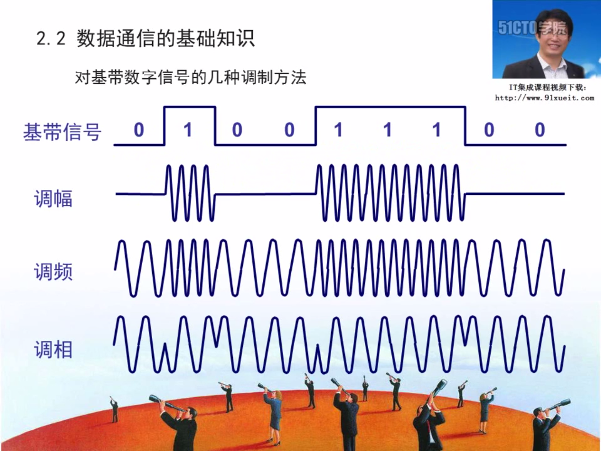
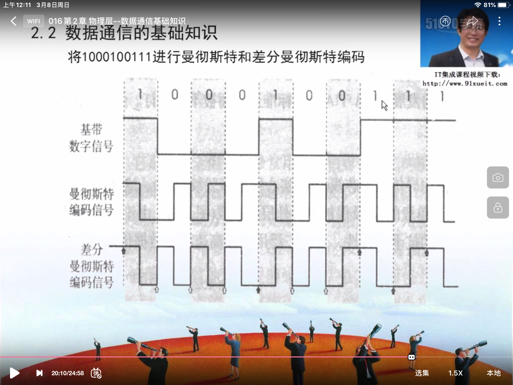
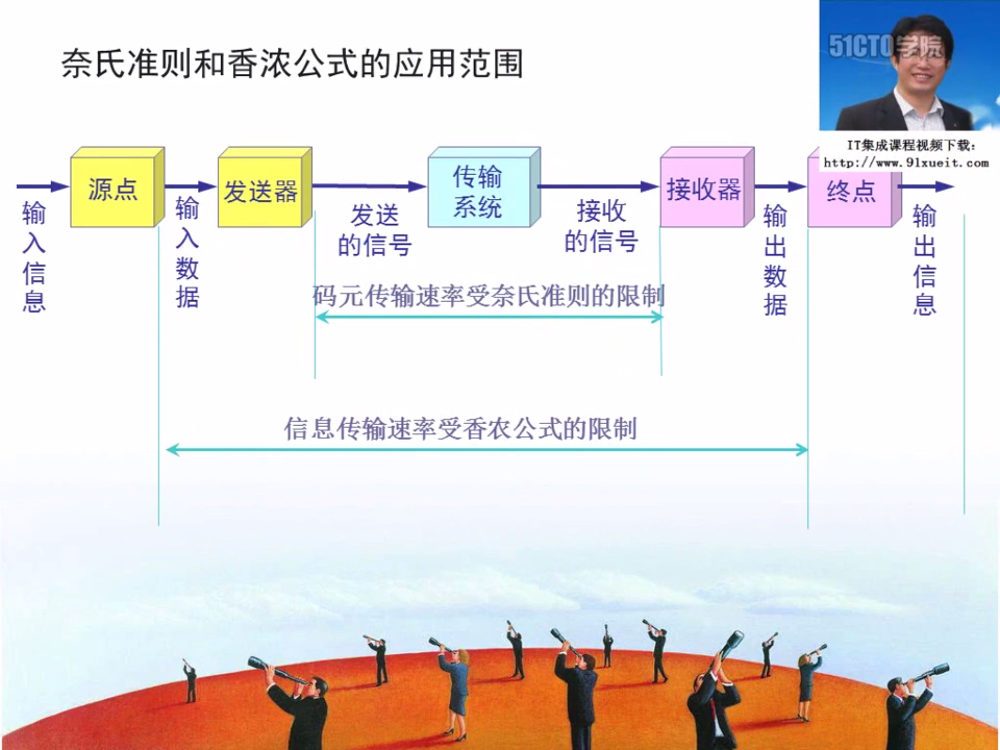

<!--
 * @Description: 
 * @version: 
 * @Author: Yuanshuo_Mac
 * @Date: 2020-03-07 20:27:47
 * @LastEditors: Yuanshuo_Mac
 * @LastEditTime: 2020-03-08 00:46:19
 -->
## 物理层的基本概念
物理层解决如何在连接各种计算机的**传输媒体**上传输**数据比特流**，而不是只具体的传输媒体。  
物理层的主要任务描述为：确定与传输媒体的接口的一些特性
- 机械特性：例接口形状、大小、引线数目
- 电气特征：例规定电压范围(-5V到5V)
- 功能特征：例规定-5V表示0，+5V表示1
- 过程特征：也称规程特征，规定建立连接时各个相关部件的工作步骤
## 数据通信的基础知识
- 相关术语
    - 通信的目的是传送消息。
    - 数据(data) - 运送消息的实体。
    - 信号(signal) - 数据的电气或电磁表现。
    - “模拟信号” - 代表消息的参数的取值是连续的。
    - “数字信号” - 代表消息的参数的取值是离散的。
    - 码元 - 在使用时间域的波形表示数字信号时，则代表不同离散数值的基本波形就成为码元。(在数字通信中常常用时间间隔相同的符号来表示一个二进制数字，这样的时间间隔内的信号称为二进制码元。而这个间隔被称为码元长度。1码元可以携带nbit的信息量。) 
- 有关信道的几个基本概念
    - 信道一般表示向一个方向传送信息的媒体。所以平时的通信线路往往包含一条发送信息的信道和一条接收信息的信道。
    - 单向通信(单工通信) - 只能有一个方向的通信二没有反方向的交互。(收音机)
    - 双向交替通信(半双工通信) - 通信的双方都可以发送信息，但不能双方同时发送(当然也就不能同时接受。)(对讲机)
    - 双向同时通信(全双工通信) - 通信的双方可以同时发送和接收信息。(打电话)
- 基带(baseband)信号和带通(band pass)信号
    - 基带信号(即基本频带信号) - 来自信源的信号，未经过处理的。像计算机输出的代表各种文字或图像文件的数据信号都属于基带信号。基带信号就是发出的直接表达了要传输的信息的信号，比如我们说话的声波就是基带信号。
    - 带通信号 - 把基带信号经过载波调制后，把信号的频率范围搬移到较高的频段以便在信道中传输(即仅在一段频率范围内能够通过信道)  
    
    由于在近距离范围内基带信号的衰减不大，从而信号内容不会发生变化。因此在传输距离较近时，计算机网络都采用基带传输方式。如从计算机到监视器、打印机等外设的信号就是基带传输的。
- 几种最基本的调制方法
    - 调幅(AM)：载波的振幅随基带数字信号而变化。
    - 调频(FM)：载波的频率随基带数字信号而变化。
    - 调相(PM)：载波的初始相位随基带数字信号而变化。()
    
    
- 常用编码
    - 单极性不归零码：只使用一个电压值，用高电平表示1，没电压表示0.
    - 双极性不归零码：用正电平和负电平分别表示二进制数据的1和0，正负幅值相等。
    - 双极性归零码：正负零三个电平，信号本身携带同步信息。
    - 曼彻斯特编码
        - bit中间有信号低-高跳变为0
        - bit中间有信号高-低跳变为1
        - 采用曼彻斯特编码，一个时钟周期只可表示一个bit，并且必须通过两次采样才能得到一个bit，但它能携带时钟信号，且可表示没有数据传输。
    - 差分曼彻斯特编码
        - 有跳变代表0，无跳变代表1。
        - 与曼彻斯特编码相同，但抗干扰性能强于曼彻斯特编码。
        

## 数据通信的基本知识
- 信道的极限容量：在任何信道中，码元传输的速率是有上限的，否则就会出现码间串扰问题，使接收端对码元的判决(即识别)成为不可能。
- 奈氏准则：理想低通信道的最高码元传输速率 = 2WBaud
    - W是理想低通信道的带宽，单位HZ。
    - Baud是波特，是码元传输速率的单位。
    - 波特与Bit的区别
        - 波特：在调制解调器中经常用到波特这个概念。
        - Bit是信息量。
        - 如果一个码元含有3个Bit信息量，1波特 = 3Bit/s
- 信噪比
    - 香农用信息论的理论推导出了带宽受限且有高斯白噪声干扰的信道的极限、无差错的信息传输速率。
    - 信道的极限信息传输速率C可表示为：C = Wlog2(1+S/N) b/s
        - W为信道的带宽(以Hz为单位)
        - S为信道内所传信号的平均功率
        - N为信道内部的高斯噪声功率
    - 香农公式表明：信道的带宽或信道中的信噪比越大，则信息的极限传输速率就越高。只要信息传输速率低于信道的极限信息传输速率，就一定可以找到某种办法来实现无差错的传输。若信道带宽W或信噪比S/N没有上限，则信道的极限信息传输速率C也就没有上限。实际信道上能够达到的信息传输速率要比香农的极限速率低不少。  
    
    

